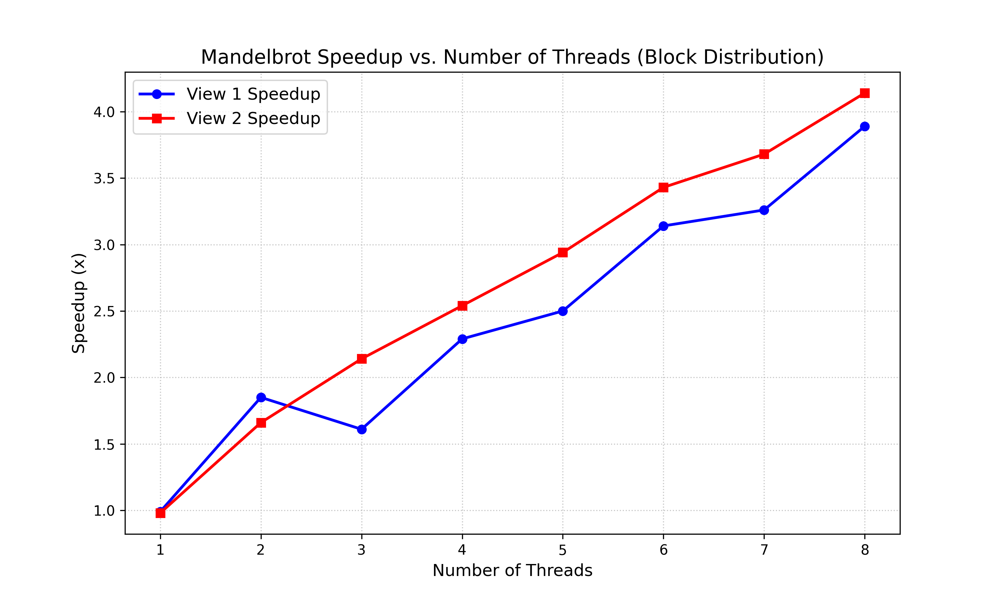
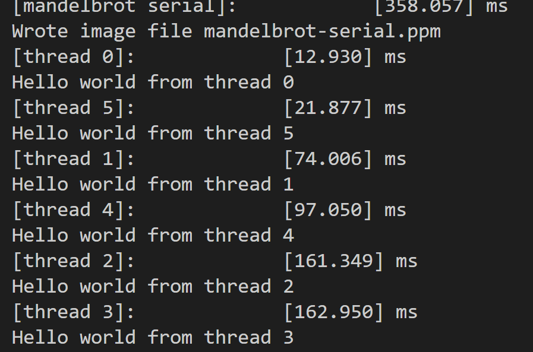
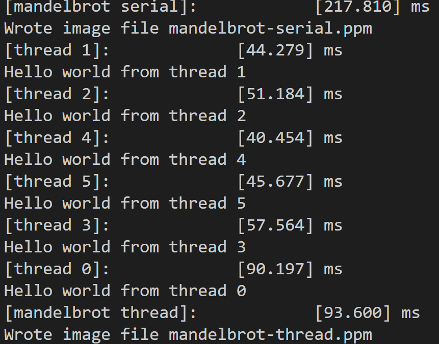
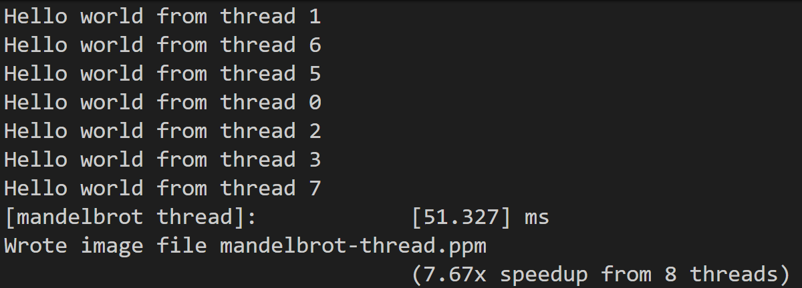
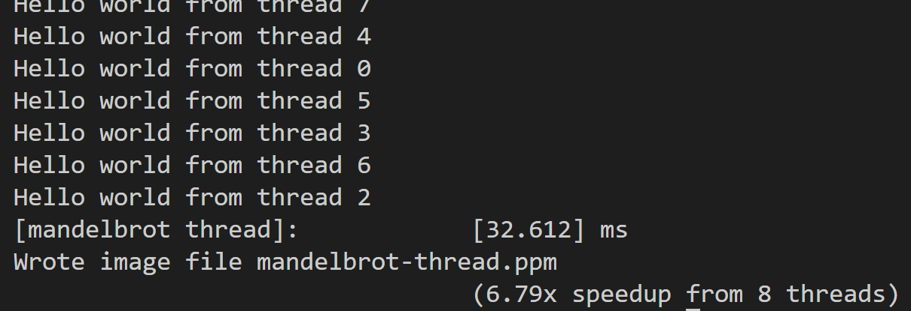

# Assignment 1: Performance Analysis on a Quad-Core CPU #

**Due Mon Oct 6, 11:59pm**

**100 points total + 6 points extra credit**

**If you are using a laptop, please plug in the power adapter; otherwise, the performance boost may not be achieved.**

**My cpu is i7 13700H, which has 6 p-cores and 8 e-cores, 20 threads in total.**
## Program 1: Parallel Fractal Generation Using Threads (20 points) ##


**What you need to do:**

1.  Modify the starter code to parallelize the Mandelbrot generation using 
 two processors. Specifically, compute the top half of the image in
  thread 0, and the bottom half of the image in thread 1. This type
    of problem decomposition is referred to as _spatial decomposition_ since
  different spatial regions of the image are computed by different processors.
  **Ans:** See code.
2.  Extend your code to use 2, 3, 4, 5, 6, 7, and 8 threads, partitioning the image
  generation work accordingly (threads should get blocks of the image). Note that the processor only has four cores but each
  core supports two hyper-threads, so it can execute a total of eight threads interleaved on its execution contents.
  In your write-up, produce a graph of __speedup compared to the reference sequential implementation__ as a function of the number of threads used __FOR VIEW 1__. Is speedup linear in the number of threads used? In your writeup hypothesize why this is (or is not) the case? (you may also wish to produce a graph for VIEW 2 to help you come up with a good answer. Hint: take a careful look at the three-thread datapoint.)
  **Ans:** 
  The speedup for view 1 is not linear. The reasons are as follows: I divide the whole graph in equal chunck for different threads. The computation cost is proportion to the brightness, thus the middle thread runs longer and the thread on the edge runs shorter. The run time is bounded by the slowest thread, so 3 thread is slower than 2 threads. In view 2, the speedup is almost linear because is more load-balancing for diffrent threads.
3.  To confirm (or disprove) your hypothesis, measure the amount of time
  each thread requires to complete its work by inserting timing code at
  the beginning and end of `workerThreadStart()`. How do your measurements
  explain the speedup graph you previously created?
  **Ans:** 
  **V1:** 
  **V2:** 
  The running time of different threads in view diverge while the running time of different threads in view 2 are almost the same. Besides, we can see from the images that the middle one(2, 3) runs significantly slower than the edge one(0, 5).
4.  Modify the mapping of work to threads to achieve to improve speedup to
  at __about 7-8x on both views__ of the Mandelbrot set (if you're above 7x that's fine, don't sweat it). You may not use any
  synchronization between threads in your solution. We are expecting you to come up with a single work decomposition policy that will work well for all thread counts---hard coding a solution specific to each configuration is not allowed! (Hint: There is a very simple static
  assignment that will achieve this goal, and no communication/synchronization
  among threads is necessary.). In your writeup, describe your approach to parallelization
  and report the final 8-thread speedup obtained. 
  **Ans:** I use the interleaved method, where thread i is responsible for chuck i, 1\*numThreads + i, 2\*numThreads + i, ...... 
  **V1:** 
  **V2:** 

5. Now run your improved code with 16 threads. Is performance noticably greater than when running with eight threads? Why or why not? 
  I change 16 to 32, since my machine support 20 logical hardware threads. No. Because it exceed the maximum threads that could be scheduled on cpu  parrellelly.
  
## Program 2: Vectorizing Code Using SIMD Intrinsics (20 points) ##

Take a look at the function `clampedExpSerial` in `prog2_vecintrin/main.cpp` of the
Assignment 1 code base.  The `clampedExp()` function raises `values[i]` to the power given by `exponents[i]` for all elements of the input array and clamps the resulting values at 9.999999.  In program 2, your job is to vectorize this piece of code so it can be run on a machine with SIMD vector instructions.

However, rather than craft an implementation using SSE or AVX2 vector intrinsics that map to real SIMD vector instructions on modern CPUs, to make things a little easier, we're asking you to implement your version using CS149's "fake vector intrinsics" defined in `CS149intrin.h`.   The `CS149intrin.h` library provides you with a set of vector instructions that operate
on vector values and/or vector masks. (These functions don't translate to real CPU vector instructions, instead we simulate these operations for you in our library, and provide feedback that makes for easier debugging.)  As an example of using the CS149 intrinsics, a vectorized version of the `abs()` function is given in `main.cpp`. This example contains some basic vector loads and stores and manipulates mask registers.  Note that the `abs()` example is only a simple example, and in fact the code does not correctly handle all inputs! (We will let you figure out why!) You may wish to read through all the comments and function definitions in `CS149intrin.h` to know what operations are available to you. 

Here are few hints to help you in your implementation:

-  Every vector instruction is subject to an optional mask parameter.  The mask parameter defines which lanes whose output is "masked" for this operation. A 0 in the mask indicates a lane is masked, and so its value will not be overwritten by the results of the vector operation. If no mask is specified in the operation, no lanes are masked. (Note this equivalent to providing a mask of all ones.) 
   *Hint:* Your solution will need to use multiple mask registers and various mask operations provided in the library.
-  *Hint:* Use `_cs149_cntbits` function helpful in this problem.
-  Consider what might happen if the total number of loop iterations is not a multiple of SIMD vector width. We suggest you test 
your code with `./myexp -s 3`. *Hint:* You might find `_cs149_init_ones` helpful.
-  *Hint:* Use `./myexp -l` to print a log of executed vector instruction at the end. 
Use function `addUserLog()` to add customized debug information in log. Feel free to add additional 
`CS149Logger.printLog()` to help you debug.

The output of the program will tell you if your implementation generates correct output. If there
are incorrect results, the program will print the first one it finds and print out a table of
function inputs and outputs. Your function's output is after "output = ", which should match with 
the results after "gold = ". The program also prints out a list of statistics describing utilization of the CS149 fake vector
units. You should consider the performance of your implementation to be the value "Total Vector 
Instructions". (You can assume every CS149 fake vector instruction takes one cycle on the CS149 fake SIMD CPU.) "Vector Utilization" 
shows the percentage of vector lanes that are enabled. 

**What you need to do:**

1.  Implement a vectorized version of `clampedExpSerial` in `clampedExpVector` . Your implementation 
should work with any combination of input array size (`N`) and vector width (`VECTOR_WIDTH`). 
2.  Run `./myexp -s 10000` and sweep the vector width from 2, 4, 8, to 16. Record the resulting vector 
utilization. You can do this by changing the `#define VECTOR_WIDTH` value in `CS149intrin.h`. 
Does the vector utilization increase, decrease or stay the same as `VECTOR_WIDTH` changes? Why?
**Output:**
```shell
CLAMPED EXPONENT (required) 
Results matched with answer!
****************** Printing Vector Unit Statistics *******************
Vector Width:              2
Total Vector Instructions: 167728
Vector Utilization:        83.3%
Utilized Vector Lanes:     279354
Total Vector Lanes:        335456
************************ Result Verification *************************
Passed!!!

CLAMPED EXPONENT (required) 
Results matched with answer!
****************** Printing Vector Unit Statistics *******************
Vector Width:              4
Total Vector Instructions: 97076
Vector Utilization:        78.1%
Utilized Vector Lanes:     303250
Total Vector Lanes:        388304
************************ Result Verification *************************
Passed!!!

CLAMPED EXPONENT (required) 
Results matched with answer!
****************** Printing Vector Unit Statistics *******************
Vector Width:              8
Total Vector Instructions: 52878
Vector Utilization:        75.5%
Utilized Vector Lanes:     319300
Total Vector Lanes:        423024
************************ Result Verification *************************
Passed!!!

CLAMPED EXPONENT (required) 
Results matched with answer!
****************** Printing Vector Unit Statistics *******************
Vector Width:              16
Total Vector Instructions: 27593
Vector Utilization:        74.3%
Utilized Vector Lanes:     327955
Total Vector Lanes:        441488
************************ Result Verification *************************
Passed!!!

ARRAY SUM (bonus) 
Expected 9825.218750, got 0.000000
.@@@ Failed!!!
```
Apparently, the utilization rate is decreasing. Since high exponent element compute more but are less frequent in the array and the program will continue execute until all counts are 0, thus the wider the width, the higher the probability that a vector contains large exponent and the other lanes are ignored.
3.  _Extra credit: (1 point)_ Implement a vectorized version of `arraySumSerial` in `arraySumVector`. Your implementation may assume that `VECTOR_WIDTH` is a factor of the input array size `N`. Whereas the serial implementation runs in `O(N)` time, your implementation should aim for runtime of `(N / VECTOR_WIDTH + VECTOR_WIDTH)` or even `(N / VECTOR_WIDTH + log2(VECTOR_WIDTH))`  You may find the `hadd` and `interleave` operations useful.
**See code**

## Program 3: Parallel Fractal Generation Using ISPC (20 points) ##

Now that you're comfortable with SIMD execution, we'll return to parallel Mandelbrot fractal generation (like in program 1). Like Program 1, Program 3 computes a mandelbrot fractal image, but it achieves even greater speedups by utilizing both the CPU's four cores and the SIMD execution units within each core.

In Program 1, you parallelized image generation by creating one thread
for each processing core in the system. Then, you assigned parts of
the computation to each of these concurrently executing
threads. (Since threads were one-to-one with processing cores in
Program 1, you effectively assigned work explicitly to cores.) Instead
of specifying a specific mapping of computations to concurrently
executing threads, Program 3 uses ISPC language constructs to describe
*independent computations*. These computations may be executed in
parallel without violating program correctness (and indeed they
will!). In the case of the Mandelbrot image, computing the value of
each pixel is an independent computation. With this information, the
ISPC compiler and runtime system take on the responsibility of
generating a program that utilizes the CPU's collection of parallel
execution resources as efficiently as possible.

You will make a simple fix to Program 3 which is written in a combination of
C++ and ISPC (the error causes a performance problem, not a correctness one).
With the correct fix, you should observe performance that is over 32 times
greater than that of the original sequential Mandelbrot implementation from
`mandelbrotSerial()`.


### Program 3, Part 1. A Few ISPC Basics (10 of 20 points) ###

**What you need to do:**

1.  Compile and run the program mandelbrot ispc. __The ISPC compiler is currently configured to emit 8-wide AVX2 vector instructions.__  What is the maximum
  speedup you expect given what you know about these CPUs?
  Why might the number you observe be less than this ideal? (Hint:
  Consider the characteristics of the computation you are performing?
  Describe the parts of the image that present challenges for SIMD
  execution? Comparing the performance of rendering the different views
  of the Mandelbrot set may help confirm your hypothesis.).  

  We remind you that for the code described in this subsection, the ISPC
  compiler maps gangs of program instances to SIMD instructions executed
  on a single core. This parallelization scheme differs from that of
  Program 1, where speedup was achieved by running threads on multiple
  cores.

If you look into detailed technical material about the CPUs in the myth machines, you will find there are a complicated set of rules about how many scalar and vector instructions can be run per clock.  For the purposes of this assignment, you can assume that there are about as many 8-wide vector execution units as there are scalar execution units for floating point math.   

**Ans:** Maximum speedup should be 8x. On my machine, I achieve 3.5x speedup in view1 and 2.8x speedup in view2. This is due to the divergence in different lanes of an AVX2 instruciton. The area which present challanges for SIMD instructions is the edge between black and white, where the computation is significantly different. Since view2 has more those edges area, its speedup is smaller than view1.

### Program 3, Part 2: ISPC Tasks (10 of 20 points) ###

ISPCs SPMD execution model and mechanisms like `foreach` facilitate the creation
of programs that utilize SIMD processing. The language also provides an additional
mechanism utilizing multiple cores in an ISPC computation. This mechanism is
launching _ISPC tasks_.

See the `launch[2]` command in the function `mandelbrot_ispc_withtasks`. This
command launches two tasks. Each task defines a computation that will be
executed by a gang of ISPC program instances. As given by the function
`mandelbrot_ispc_task`, each task computes a region of the final image. Similar
to how the `foreach` construct defines loop iterations that can be carried out
in any order (and in parallel by ISPC program instances, the tasks created by
this launch operation can be processed in any order (and in parallel on
different CPU cores).

**What you need to do:**

1.  Run `mandelbrot_ispc` with the parameter `--tasks`. What speedup do you
  observe on view 1? What is the speedup over the version of `mandelbrot_ispc` that
  does not partition that computation into tasks?

**Ans:** 6.00x speedup from task ISPC, 3.58x speedup from ISPC.
2.  There is a simple way to improve the performance of
  `mandelbrot_ispc --tasks` by changing the number of tasks the code
  creates. By only changing code in the function
  `mandelbrot_ispc_withtasks()`, you should be able to achieve
  performance that exceeds the sequential version of the code by over 32 times!
  How did you determine how many tasks to create? Why does the
  number you chose work best?
**Ans:** 32, this is roughly my total logical threads of all cores.

3.  _Extra Credit: (2 points)_ What are differences between the thread
  abstraction (used in Program 1) and the ISPC task abstraction? There
  are some obvious differences in semantics between the (create/join
  and (launch/sync) mechanisms, but the implications of these differences
  are more subtle. Here's a thought experiment to guide your answer: what
  happens when you launch 10,000 ISPC tasks? What happens when you launch
  10,000 threads? (For this thought experiment, please discuss in the general case - 
  i.e. don't tie your discussion to this given mandelbrot program.)
**Ans:** Thread is allocated and managed by os, while ISPC task abstraction is declarative of your intention.


_The smart-thinking student's question_: Hey wait! Why are there two different
mechanisms (`foreach` and `launch`) for expressing independent, parallelizable
work to the ISPC system? Couldn't the system just partition the many iterations
of `foreach` across all cores and also emit the appropriate SIMD code for the
cores?

_Answer_: Great question! And there are a lot of possible answers. Come to
office hours.

## Program 4: Iterative `sqrt` (15 points) ##

Program 4 is an ISPC program that computes the square root of 20 million
random numbers between 0 and 3. It uses a fast, iterative implementation of
square root that uses Newton's method to solve the equation ${\frac{1}{x^2}} - S = 0$.
The value 1.0 is used as the initial guess in this implementation. The graph below shows the 
number of iterations required for `sqrt` to converge to an accurate solution 
for values in the (0-3) range. (The implementation does not converge for 
inputs outside this range). Notice that the speed of convergence depends on the 
accuracy of the initial guess.

Note: This problem is a review to double-check your understanding, as it covers similar concepts as programs 2 and 3.

.")

**What you need to do:**

1.  Build and run `sqrt`. Report the ISPC implementation speedup for 
  single CPU core (no tasks) and when using all cores (with tasks). What 
  is the speedup due to SIMD parallelization? What is the speedup due to 
  multi-core parallelization?
**Ans:** 3.68x for no task, 48.07x for with task. There for 3.68x speedup due to SIMD parallelization and 48.07/3.68 = 12.62x speedup due to multi-core parallelization.

2.  Modify the contents of the array values to improve the relative speedup 
  of the ISPC implementations. Construct a specifc input that __maximizes speedup over the sequential version of the code__ and report the resulting speedup achieved (for both the with- and without-tasks ISPC implementations). Does your modification improve SIMD speedup?
  Does it improve multi-core speedup (i.e., the benefit of moving from ISPC without-tasks to ISPC with tasks)? Please explain why.

  **Ans:** All value\[i\] are 2.999999, 5.05x for with-task, 66.83 for without task. It improve SIMD speedup significantly while it barely improve multicore speedup. This is because the computation is less divergent, so the SIMD speedup up improves; Since 64 tasks already exhaust all cpu threads, the multicore speedup barely improves.
3.  Construct a specific input for `sqrt` that __minimizes speedup for ISPC (without-tasks) over the sequential version of the code__. Describe this input, describe why you chose it, and report the resulting relative performance of the ISPC implementations. What is the reason for the loss in efficiency? 
    __(keep in mind we are using the `--target=avx2` option for ISPC, which generates 8-wide SIMD instructions)__. 
**Ans:** Seven 1s and one 2.999999. 0.77x speedup from ISPC. Due to execution Divergence, as long as there is a lane running, the SIMD instruction won't stop, so the 7 lanes are wasted. And ISPC and SIMD needs extra overthead, so the speedup is less than 1.

4.  _Extra Credit: (up to 2 points)_ Write your own version of the `sqrt` 
 function manually using AVX2 intrinsics. To get credit your 
    implementation should be nearly as fast (or faster) than the binary 
    produced using ISPC. You may find the [Intel Intrinsics Guide](https://software.intel.com/sites/landingpage/IntrinsicsGuide/) 
    very helpful.
**Ans:** See codes. My avx2 achieve 4.85 speedup which is slightly better than ISPC's 3.80x speedup.

## Program 5: BLAS `saxpy` (10 points) ##

Program 5 is an implementation of the saxpy routine in the BLAS (Basic Linear
Algebra Subproblems) library that is widely used (and heavily optimized) on 
many systems. `saxpy` computes the simple operation `result = scale*X+Y`, where `X`, `Y`, 
and `result` are vectors of `N` elements (in Program 5, `N` = 20 million) and `scale` is a scalar. Note that 
`saxpy` performs two math operations (one multiply, one add) for every three 
elements used. `saxpy` is a *trivially parallelizable computation* and features predictable, regular data access and predictable execution cost.

**What you need to do:**

1.  Compile and run `saxpy`. The program will report the performance of
  ISPC (without tasks) and ISPC (with tasks) implementations of saxpy. What 
  speedup from using ISPC with tasks do you observe? Explain the performance of this program.
  Do you think it can be substantially improved? (For example, could you rewrite the code to achieve near linear speedup? Yes or No? Please justify your answer.)
**Ans:** Only 1.81x speedup. Since this is a memory bound task, its limited by the bandwitch of memory rather than cpu.
2. __Extra Credit:__ (1 point) Note that the total memory bandwidth consumed computation in `main.cpp` is `TOTAL_BYTES = 4 * N * sizeof(float);`.  Even though `saxpy` loads one element from X, one element from Y, and writes one element to `result` the multiplier by 4 is correct.  Why is this the case? (Hint, think about how CPU caches work.)
**Ans:** Whenever we want to write to mem, we must first read it from mem into cahce, which plus the number of mem operations.

3. __Extra Credit:__ (points handled on a case-by-case basis) Improve the performance of `saxpy`.
  We're looking for a significant speedup here, not just a few percentage 
  points. If successful, describe how you did it and what a best-possible implementation on these systems might achieve. Also, if successful, come tell the staff, we'll be interested. ;-)

Notes: Some students have gotten hung up on this question (thinking too hard) in the past. We expect a simple answer, but the results from running this problem might trigger more questions in your head.  Feel encouraged to come talk to the staff.

**Ans:** I tired `streaming_store` but failed.

## Program 6: Making `K-Means` Faster (15 points) ##

**Ans:** I have no access to the dataset, skipped this task.
